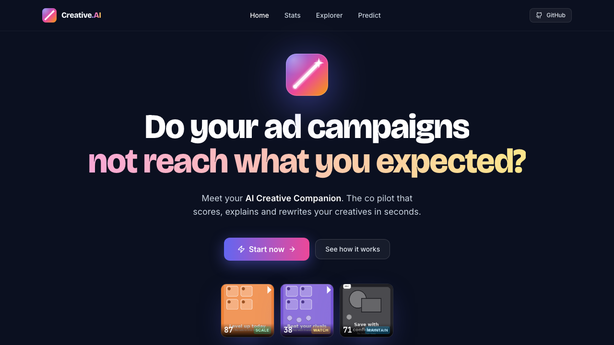
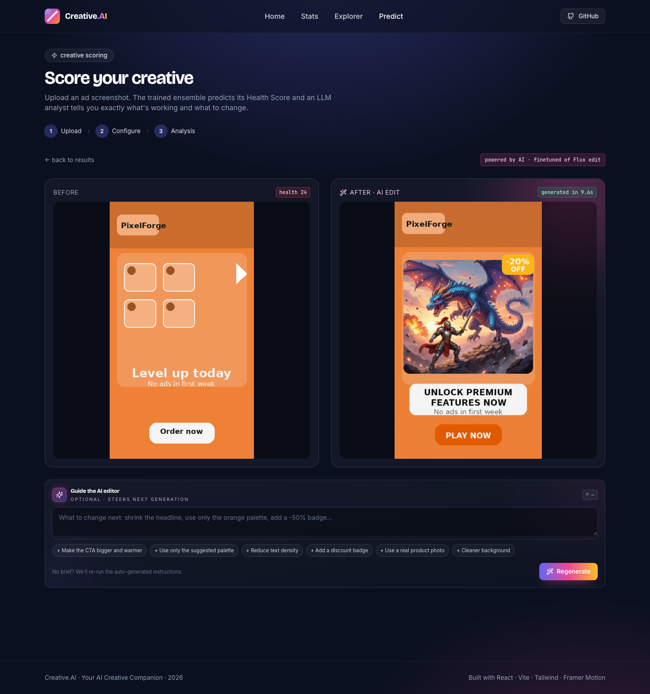
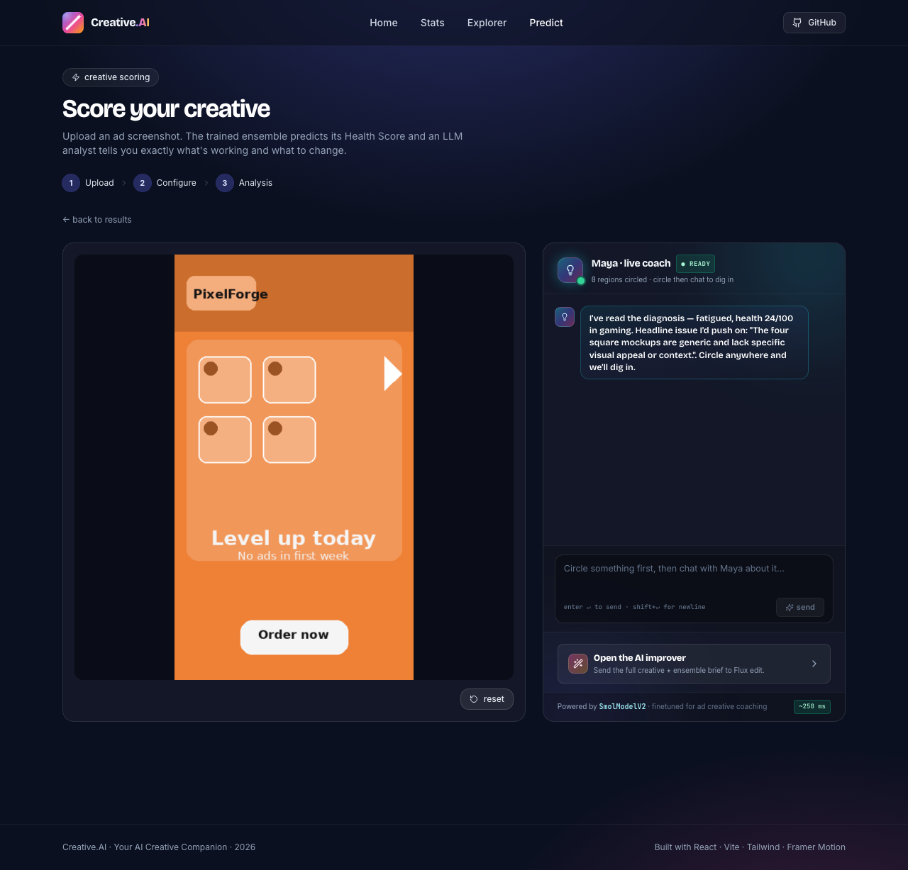

# Creative.AI — your AI creative companion

[](https://creativecommons.org/licenses/by-nc/4.0/)
[](#)
[](https://devpost.com/software/1255864/joins/slY8Ptgh7NczoDZ5pHMI6g)
[](models/docs/06_evaluation.md)

<p align="center">
  
</p>

> A proposal to improve mobile-ad campaigns, submitted to the **Smadex Creative Intelligence Challenge** at **HackUPC 2026**.

Drop a screenshot of an ad creative. Get back a Health Score, a structured analysis, an AI rebuild, and a circle-to-ask live coach. Three personalised models do the work; the front-end ships with precomputed predictions for the 1,076-creative dataset so it runs offline.

---

## Highlights

- **Three personalised models** — a soft-vote tabular ensemble for scoring, a fine-tuned SmolVLM for structured analysis, and a Flux LoRA + DPO edit for visual rebuilds.
- **Honest evaluation** — held-out test macro-F1 = **0.677** · top-performer AUC **0.94** · underperformer AUC **0.98** · ECE **0.096**. No leakage; full audit in [`models/docs/06_evaluation.md`](models/docs/06_evaluation.md).
- **Runs offline** — the SPA ships with precomputed predictions for all 1,076 creatives; the OpenRouter key only powers live VLM analysis and image edits on the Predict page.
- **One-command setup** — `./run.sh` starts the FastAPI backend on `:8000` and the Vite SPA on `:5173` in parallel.

---

## Models

| | Model | Role |
|---|---|---|
| **1** | Soft-vote tabular ensemble (XGBoost ×5 + LightGBM + CatBoost + HistGBM + LogReg) | 4-class status, 0–100 Health Score, counterfactual lifts |
| **2** | Personalised SmolVLM (full fine-tune + SDFT) | Structured analysis JSON: strengths, weaknesses, fatigue reason, fixes |
| **3** | Flux edit (rank-32 LoRA + reward-weighted DPO) | Ensemble-driven creative rebuild |

---

## Screenshots

A taste — the AI rebuild and the circle-to-ask coach. Full walkthrough in [`docs/SCREENSHOTS.md`](docs/SCREENSHOTS.md).

<table>
  <tr>
    <td width="50%"><br /><sub><b>Predict · improve</b> — Flux LoRA + DPO rewrites the creative; refine via chat.</sub></td>
    <td width="50%"><br /><sub><b>Predict · coach</b> — circle any region of the ad; Maya explains the diagnosis and what to change.</sub></td>
  </tr>
</table>

<p align="center"><a href="docs/SCREENSHOTS.md"></a></p>

---

## Two quickstarts

### A · Run the app

```bash
pip install -r models/requirements.txt
(cd front && npm install)
echo "VITE_OPENROUTER_API_KEY=sk-or-..." > front/.env.local
./run.sh
```

→ Frontend at http://localhost:5173 · Backend at http://localhost:8000.

The frontend renders without the backend (precomputed predictions are shipped). The OpenRouter key only powers the live VLM analysis + image edit on the Predict page.

### B · Reproduce the models

```bash
# Model 1 — Tabular ensemble (~25 s on CPU)
python3 models/scripts/build_clean_dataset.py
python3 models/scripts/train_clean.py --final

# Lifecycle curves + per-vertical palettes (front-end lookup tables)
PYTHONPATH=models python3 models/scripts/train_lifecycle.py
PYTHONPATH=models python3 models/scripts/build_palette_lookup.py
```

Models 2 and 3 need a single H100 + OpenRouter credits — see [`models/README.md`](models/README.md).

---

## Navigate the source

Start where you want to land. Each line tells you where the code lives.

```
.
├── data/                       raw inputs (1,076 PNGs + 7 CSVs)
│
├── models/                     ── modeling side ──────────────────────────
│   ├── README.md               ← start here for the modeling side
│   ├── docs/                   ordered written deep-dives
│   │   ├── 01_pipeline_overview.md       big picture · file map
│   │   ├── 02_data_pipeline.md           audit · leakage · splits
│   │   ├── 03_tabular_models.md          5-model ensemble · fatigue · lifecycle
│   │   ├── 04_visual_intelligence.md     embeddings · clusters · palettes
│   │   ├── 05_personalized_vlm_…md       SmolVLM full FT · Flux LoRA + DPO
│   │   └── 06_evaluation.md              metrics · calibration · caveats
│   ├── notebooks/              narrative pipeline (run in order 01_…05_)
│   ├── scripts/                entry-point CLIs — one per phase
│   ├── src/                    library code (imported by scripts + notebooks)
│   │   ├── data/                  loaders, feature engineering, early-life, rubric, time-series
│   │   ├── embeddings/            CLIP / SigLIP encoder
│   │   ├── models/                tabular_model · fatigue_detector · recommender · vlm_model
│   │   ├── calibration/           temperature scaling
│   │   ├── fatigue/               BOCPD changepoint + 0–100 health-score blend
│   │   ├── inference/             pipeline · explainer · DPP recommender · VLM inference
│   │   ├── training/              OpenRouter rubric + teacher · SDFT · continual learning
│   │   └── evaluation/            metric helpers
│   ├── tests/                  pytest suite (≈24 cases)
│   └── outputs/                committed artefacts: splits · models · embeddings · clusters · …
│
├── back/                       ── FastAPI backend ────────────────────────
│   └── main.py                    one file, ~12 endpoints
│
├── front/                      ── React 18 + Vite + Tailwind SPA ────────
│   ├── src/
│   │   ├── App.tsx                routes + scroll-to-top
│   │   ├── main.tsx               entry point
│   │   ├── pages/                 HomePage · StatsPage · ExplorerPage · PredictPage
│   │   ├── components/            Logo · Navbar · Footer
│   │   └── lib/                   data.ts · predict.ts · openrouter.ts (chat + analyze + edit)
│   ├── public/data/            precomputed predictions · metadata · lifecycle curves · palettes
│   └── tests/                  Playwright smoke specs
│
├── docs/images/                README screenshots
├── run.sh                      starts back + front in one command
├── LICENSE                     CC BY-NC 4.0
└── README.md                   ← you are here
```

**If you want to read the pipeline end-to-end**, follow the order in [`models/README.md`](models/README.md): docs `01` → notebooks `01_…05_` → docs `02…06`.

**If you want to dive into a specific page** (Predict, Explorer, …), open the matching file under `front/src/pages/`. The Predict page's circle-to-ask chat is in [`front/src/pages/PredictPage.tsx`](front/src/pages/PredictPage.tsx), and the LLM client (analyse, chat, image-edit) is in [`front/src/lib/openrouter.ts`](front/src/lib/openrouter.ts).

---

## Team

A team of four who all took part in idea discussion, modeling, and every step of the ideation process behind this project.

- **Chengheng Li** — [GitHub](https://github.com/ChenghengLi) · [LinkedIn](https://www.linkedin.com/in/chengheng-li/)
- **Hao Chen** — [GitHub](https://github.com/HChen02) · [LinkedIn](https://www.linkedin.com/in/hao-chen-ai/)
- **Zhiqian Zhou** — [GitHub](https://github.com/Zhiqian-Zhou) · [LinkedIn](https://www.linkedin.com/in/zhiqian-zhou-196350300/)
- **Xu Yao** — [GitHub](https://github.com/xuyaooo) · [LinkedIn](https://www.linkedin.com/in/xu-yao-140059231/)

---

## License

Released under [**CC BY-NC 4.0**](https://creativecommons.org/licenses/by-nc/4.0/) — educational, research, and demo use only. **Commercial use is not permitted**; for that, contact the authors. Full text in [`LICENSE`](LICENSE). SPDX: `CC-BY-NC-4.0`.

The dataset is synthetic; all names, apps, and metrics are fabricated.

<sub><i>Where self-hosting our trained models isn't feasible (no GPU, no weights mounted, or running the static SPA standalone), the app transparently falls back to third-party equivalents via OpenRouter — Gemini 2.5 Flash Lite for the analysis JSON, Gemini 2.5 Flash Image (Nano Banana) for the rebuild. Same prompts, same output schema.</i></sub>
