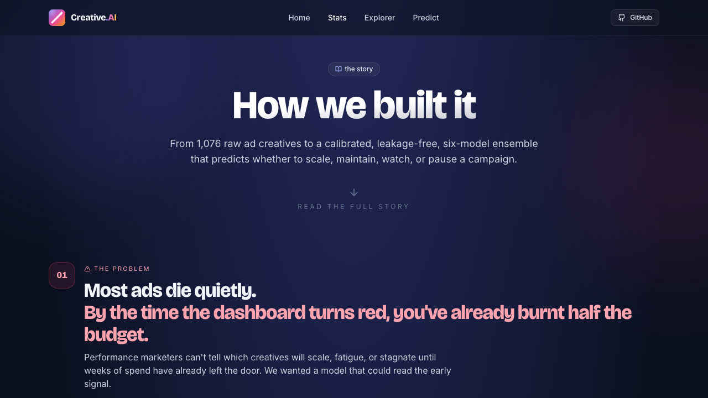
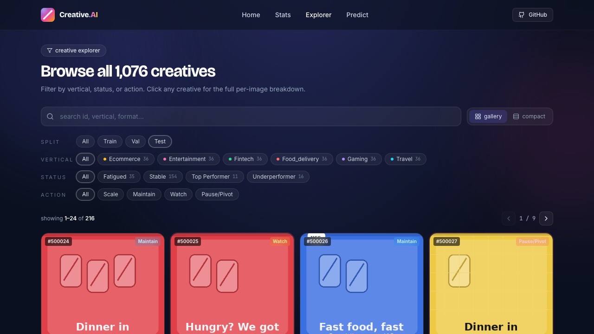
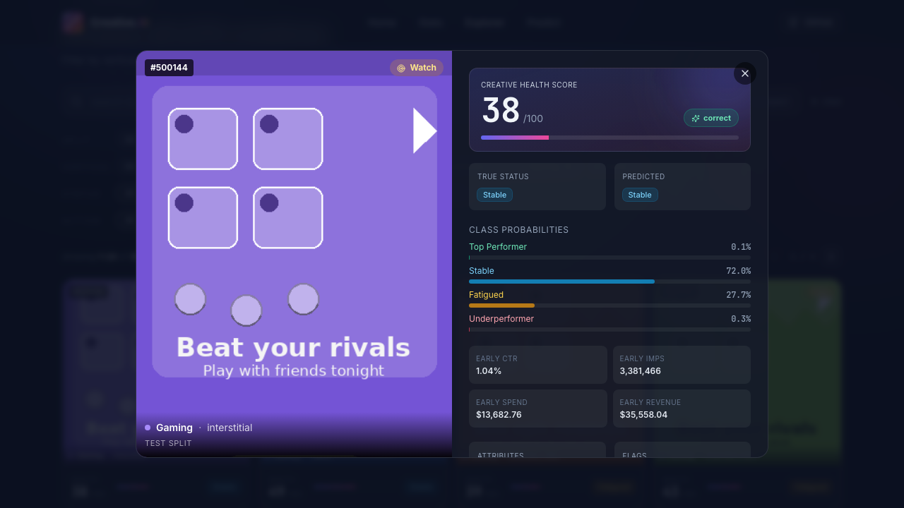
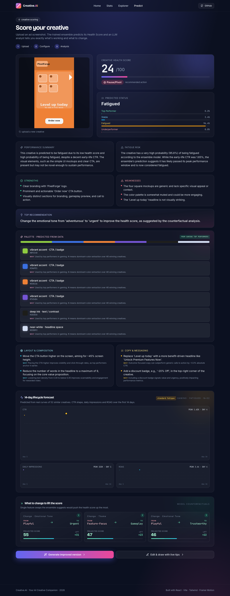

# Screenshots

A walk through every page of **Creative.AI**, in the order a user would encounter them. Each shot is a real Playwright capture against the running app — no mockups.

← [Back to README](../README.md)

---

## 1 · Home — Hero

The landing page. Logo, headline, subtitle, CTA buttons, and three live sample cards.

---

## 2 · Stats — How we built it

Cinematic narrative: the modeling pipeline, leakage-fixed CV, ablations, and headline metrics, told as a scroll story.

---

## 3 · Explorer — Browse the dataset

Filter all 1,076 creatives by vertical, status, action; gallery / compact view; click any card for the full breakdown.

---

## 4 · Detail — Per-creative breakdown

Health Score, true vs predicted status, full class probabilities, early-life CTR / impressions / spend / revenue.

---

## 5 · Predict · Results — Live analysis

Drop your own ad screenshot and the trained ensemble predicts a Health Score, fatigue diagnosis, strengths, weaknesses, palette suggestions, top recommendation, 14-day lifecycle forecast, and one-feature counterfactuals.

---

## 6 · Predict · Improve — AI rebuild

The AI improver runs Flux + rank-32 LoRA + reward-weighted DPO and returns a side-by-side BEFORE / AFTER. Refine the rebuild with a chat box.

---

## 7 · Predict · Coach — Circle to ask

Circle any region of the creative; Maya, the live coach, reads the diagnosis (e.g. *"fatigued, health 24/100 in gaming"*) and explains exactly what to change in that area.

---

← [Back to README](../README.md)
